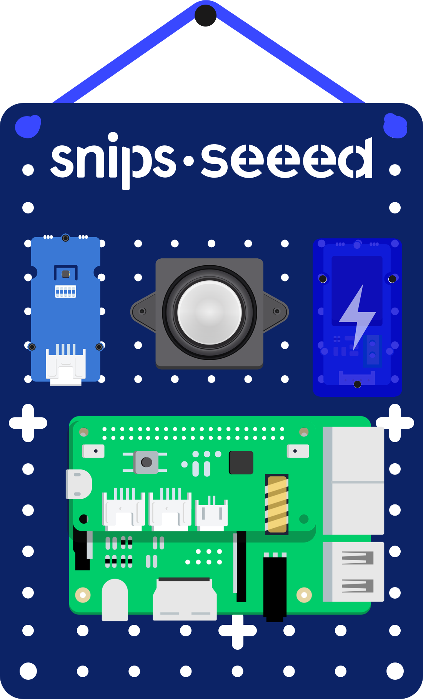
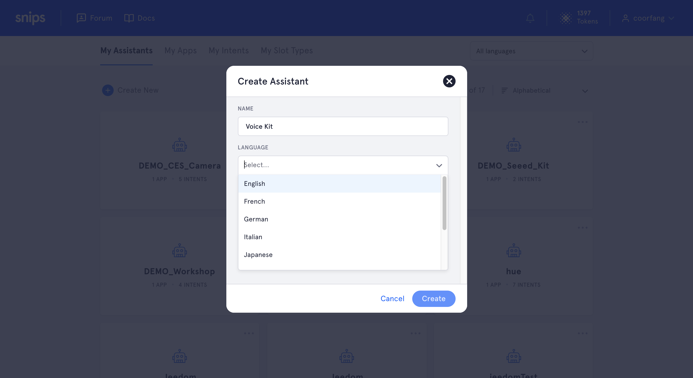
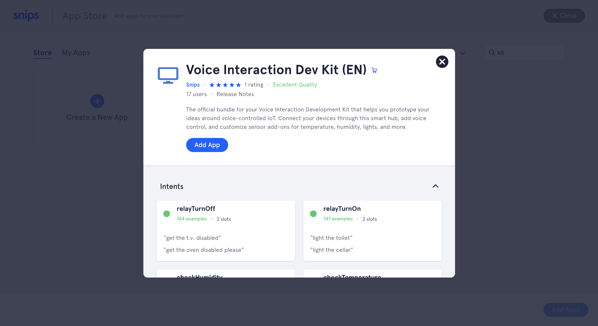
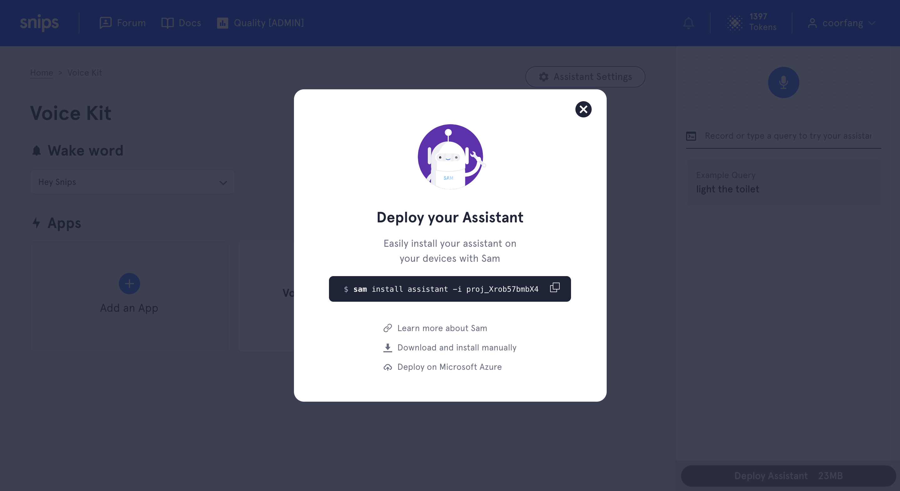

[](https://github.com/snipsco/snips-demo-dev-kit/blob/master/LICENSE)
[](https://github.com/snipsco/snips-demo-dev-kit/blob/master/)

# snips-demo-dev-kit

Official action code for [Snips Voice Interaction Development Kit](https://www.seeedstudio.com/snips.html).

It's composed of [snips-app-relay-switch](https://github.com/snipsco/snips-app-relay-switch/) and [snips-app-sht31](https://github.com/snipsco/snips-app-sht31/), enables you to control the connected relay module and fetch the indoor environment informations.

## Usage

#### :bulb: Controlling a connected device

***```"Hey snips, please turn on my light"```***

***```"Hey snips, please turn off my light"```***

#### :snowman: Asking for temperature

***```"Hey snips, please tell me the current temperature?"```***

#### :bamboo: Asking for humidity

***```"Hey snips, what's the humidity in the room?"```***

## Installation

### Pre-required

Please make sure that `_snips-skills` user has permission to access `gpio` and `i2c`.

To grant this permission, run the following command **on Raspberry Pi**:

```bash
sudo usermod -a -G i2c,spi,gpio,audio _snips-skills
```

If install to a satellite device, please make sure it has `snips-skill-server` installed first.

To install `snips-skill-server`:

```bash
sudo apt-get install snips-skill-server
```

### With Assistant (Recommend)

1. Create a Snips account **[here](https://console.snips.ai/signup)**

<p align="center">
    
</p>

2. Create an assistant in **[Snips Console](https://console.snips.ai/)**

<p align="center">
    
</p>

3. Add **Voice Interaction Dev Kit** App to your assistant

- **[English App](https://console.snips.ai/store/en/skill_327kQdNonx85) :us:**
- **[French App](https://console.snips.ai/store/fr/skill_m6Aoky9NQ5w) :fr:**
- **[Japanese App](https://console.snips.ai/store/ja/skill_gyP2M63X74o) :jp:**

<p align="center">
    
</p>

4. Deploy assistant by executing the provided command **on your laptop**

<p align="center">
    
</p>

### Only action code

Using `sam` to fetch the content of this repo **on your laptop**

```bash
sam install actions -g https://github.com/snipsco/snips-demo-dev-kit.git
```

### Manually

1. Clone the content of this repo to local:

```bash
git clone https://github.com/snipsco/snips-demo-dev-kit.git
```

2. Run `setup.sh` to install:

```bash
cd snips-demo-dev-kit/
./setup.sh
```

3. Activate virtual environment:

```bash
source venv/bin/activate
```

4. Run the action code:

```
./action-demo_dev_kit.py
```

## Configurations

### Connection

| Config | Description | Value | Default |
| --- | --- | --- | --- |
| `mqtt_host` | MQTT host name | `<ip address>`/`<hostname>` | `localhost` |
| `mqtt_port` | MQTT port number | `<mqtt port>` | `1883` |
| `site_id` | Snips device ID | Refering to the actual `snips.toml` | `default` |

##### :bangbang: ***If this skill is installed on a satellite device, please change the `site_id` to the one set for satellite, and change `mqtt_host` connecting to master device.***

### TTS language

| Config | Description | Value | Default |
| --- | --- | --- | --- |
| `locale` | The tts language | `en_US`, `fr_FR` | `en_US` |

> *NOTE: Japanese text-to-speech is not yet supported, which means that adding Japanese translation will block `snips-tts` software*

### Relay GPIO pin

| Config | Description | Value | Default |
| --- | --- | --- | --- |
| `relay_gpio_bcm` | The BCM GPIO number | [Available BCM pin number](https://www.raspberrypi.org/documentation/usage/gpio/README.md) | `12` |

### Temperature Unit

| Config | Description | Value | Default |
| --- | --- | --- | --- |
| `temperature_unit` | The unit applied to temperature | `celsius`, `fahrenheit` | `celsius` |

## Contributing

Please see the [Contribution Guidelines](https://github.com/snipsco/snips-demo-dev-kit/blob/master/CONTRIBUTING.md).

## Copyright

This library is provided by [Snips](https://www.snips.ai) as Open Source software. See [LICENSE](https://github.com/snipsco/snips-demo-dev-kit/blob/master/LICENSE) for more information.
